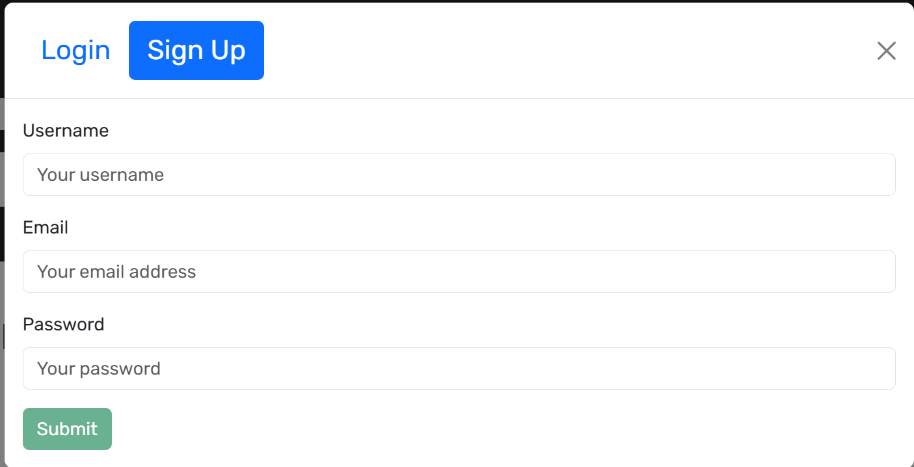
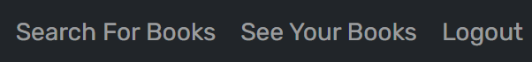

# Book-Search-Engine

## Description

This project is a Book Search Engine that leverages the Google Books API to fetch and display data about books. The purpose of this application is to serve as a way to search about books and if you create an account you can even save those books your intrested in. The other point of this app was to showcase my programming skills in Apollo and Graphql. Apollo might not be the most easy thing to learn but its a greate technology for larger scale Api's.

## Table of Contents

- [Installation](#installation)
- [Usage](#usage)
- [Credits](#credits)
- [License](#license)

## Installation

- Use this link [https://book-search-engine-hcck.onrender.com](https://book-search-engine-hcck.onrender.com) to get to deployed sit or if you want to use it on your own machine use following steps below.
- copy either all the files from the repository to your computer or use your git bash terminal to clone the repository down to your own machine. 
- make sure you have [node js](https://nodejs.org/en) and the package manager that comes with it.
- run the following command in project folder terminal: ```npm i``` 
- After installing the project run in the terminal for project: ```npm run build``` and ```npm run start:dev``` This will compile the type script files and start the project.
- The program some times will auto open the website in your browser but if not just put the following url in your browser: [http://localhost:3000/](http://localhost:3000/)

## Usage

- The website has three pages: Search For Book ages, See Your Books, and Login/Logout.
- When you first get to the web site you will be on the "Search For Books" page.
- This page will have a search bar. here enter in the name of the books you want to see and hit enter. Similar books will appear with discription about them underneath the search bar. 
- Click on Save book button to save that book if your logged in. If you not this button will not be there.
- To log in click on login button and this will pop up a modal that will let you switch between signing up or logging in.
- Enter your email and password in right fields and hit submit button or if your making an account enter in a username, email, and password.



- If something goes wrong an error message will appear otherwise you will be logged in.
- The Log in button will now be a log out button. Click on this button to log out.
- While log in you can now save books to your account and another page will appear as an option in you nav bar.
- This option will be "See Your Books" page.



- Click on this and you will see a list of books you have saved as well as details about the books. If no books are saved yet it will just say that no saved books yet.
- Under every book under this page there also a remove book button. Click this button to remove the saved book.
- For a walkthrough of how to use the application [Click Here](https://drive.google.com/file/d/1-PO97FZrt6RVq5jyAKaU1g55pshoQhGk/view?usp=sharing).

## Credits

Project Designer: Kalab Smith
- [K-Lab-Code](https://github.com/K-Lab-Code)
- [kalabsb@me.com](mailto:kalabsb@me.com)

## License

Distributed under the MIT License. See LICENSE.txt for more information.

